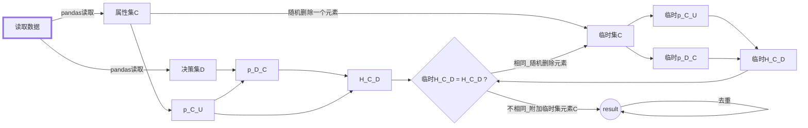

# 概率论大作业

代码流程图：

```mermaid
	graph LR
	读取数据--pandas读取-->属性集C
	读取数据--pandas读取-->决策集D
	属性集C-->p_C_U 
	决策集D-->p_D_C
	p_C_U-->p_D_C	
	p_D_C --> H_C_D
	p_C_U --> H_C_D
	属性集C--随机删除一个元素-->临时集C
	临时集C-->临时p_D_C
	临时集C-->临时p_C_U
	临时p_C_U-->临时H_C_D
	临时p_D_C-->临时H_C_D
	临时H_C_D-->BOOL{临时H_C_D = H_C_D ?}
	H_C_D-->BOOL{临时H_C_D = H_C_D ?}
	BOOL--相同_随机删除元素-->临时集C
	BOOL--不相同_附加临时集元素C-->result((result))
	result((result))--去重-->result((result))
	style 读取数据 stroke-width:4px

```

